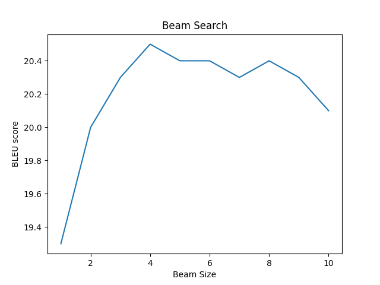

# MT Exercise 5: Byte Pair Encoding, Beam Search

This repo is just a collection of scripts showing how to install [JoeyNMT](https://github.com/joeynmt/joeynmt), download
data and train & evaluate models.

# Requirements

- This only works on a Unix-like system, with bash.
- Python 3 must be installed on your system, i.e. the command `python3` must be available
- Make sure virtualenv is installed on your system. To install, e.g.

    `pip install virtualenv`

# Steps
## Preparations

Clone this repository in the desired place:

    git clone https://github.com/emmavdbold/mt-exercise-5

Create a new virtualenv that uses Python 3. Please make sure to run this command outside of any virtual Python environment:

    ./scripts/make_virtualenv.sh

**Important**: Then activate the env by executing the `source` command that is output by the shell script above.

    source scripts/../venvs/torch3/bin/activate

Download and install required software:

    ./scripts/download_install_packages.sh

Download data:

    ./scripts/download_iwslt_2017_data.sh

## General Preprocessing

The data is only minimally preprocessed, so we tokenize it for all models.

Sub-sample parallel training data randomly to 100k sentence pairs using the following script in advance as shown in our example:

    ./scripts/subsample.sh

Tokenize the dev, test, and (subsampled) train data:

    ./scripts/tokenize.sh

## Word-level Model
Train the word-level model:

    ./scripts/train_wordlevel.sh

The training process can be interrupted at any time, and the best checkpoint will always be saved.

## BPE-level Models
### BPE Preprocessing
Before training the BPE-level models, use the following scripts to learn byte pair encoding 
on the concatenation of the training text, and get resulting vocabulary for each:

    ./scripts/learn_joint_bpe1_and_vocab.sh
    ./scripts/learn_joint_bpe2_and_vocab.sh

Apply the BPE models to all files with the following scripts:

    ./scripts/apply_bpe1.sh
    ./scripts/apply_bpe2.sh

Build a single (= the same for both languages) vocabulary file before training, 
using a script that comes with JoeyNMT that extracts a vocabulary file from 
input text:

    ./scripts/build_vocab_bpe1.sh
    ./scripts/build_vocab_bpe2.sh

### BPE Training
Train the first BPE-level model (voc size 2000):

    ./scripts/train_bpe1.sh

Train the second BPE-level model (voc size 1000):

    ./scripts/train_bpe2.sh

The training process can be interrupted at any time, and the best checkpoint will always be saved.

## Evaluation
Evaluate the trained word-level model with

    ./scripts/evaluate_word.sh

Evaluate the first trained BPE-level model with

    ./scripts/evaluate_bpe1.sh

Evaluate the second trained BPE-level model with

    ./scripts/evaluate_bpe2.sh

The results of this evaluation are the following:

Model | use BPE | vocabulary size | BLEU |
 --- | --- | --- |------|
a) word-level | no | 2000 | 11.8 |
b) bpe-level1 | yes | 2000 | 20.4 |
c) bpe-level2 | yes | 1000 | 18.5 |

### Discussion
...

# Beam Search

In order to obtain the data for the graph, execute the following commands in order to run the evaluation scripts 
(pointing to different .yaml files for the beam sizes) and to save the output:

    ./scripts/evaluate_bpe1_1.sh > ./translations/results/bpe1_k1_results.txt
    ./scripts/evaluate_bpe1_2.sh > ./translations/results/bpe1_k2_results.txt
    ./scripts/evaluate_bpe1_3.sh > ./translations/results/bpe1_k3_results.txt
    ./scripts/evaluate_bpe1_4.sh > ./translations/results/bpe1_k4_results.txt
    ./scripts/evaluate_bpe1_5.sh > ./translations/results/bpe1_k5_results.txt
    ./scripts/evaluate_bpe1_6.sh > ./translations/results/bpe1_k6_results.txt
    ./scripts/evaluate_bpe1_7.sh > ./translations/results/bpe1_k7_results.txt
    ./scripts/evaluate_bpe1_8.sh > ./translations/results/bpe1_k8_results.txt
    ./scripts/evaluate_bpe1_9.sh > ./translations/results/bpe1_k9_results.txt
    ./scripts/evaluate_bpe1_10.sh > ./translations/results/bpe1_k10_results.txt

In order to create the graph from the results, run the following command:

    python3 ./scripts/create_graph.py ./translations/results

The results are shown in the graph below:

### Discussion
...

TODO: Given your graph, describe the impact of beam size on BLEU and your personal take on
which beam size you would choose in the future.

